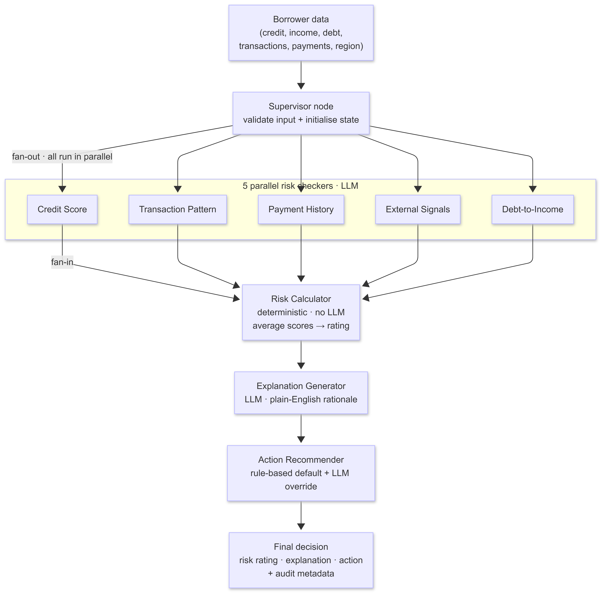
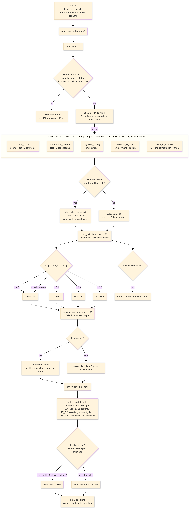

# Loan Default Risk Monitor

A multi-agent **loan-default risk monitor** built on [LangGraph](https://github.com/langchain-ai/langgraph). Given a borrower's financial profile, it fans out to **five parallel LLM "checker" agents**, aggregates their scores with a **deterministic, no-LLM calculator**, then runs a short **sequential explain → recommend pipeline** to produce an **auditable risk rating, a plain-English explanation, and a recommended action** for a bank's loan-review team.

> **Tech:** Python 3.12 · LangGraph · OpenAI (`gpt-4o-mini`) · Pydantic · LangSmith (tracing)

---

## Why this design

Lending decisions are high-stakes and regulated: they must be **consistent**, **explainable**, and **fail safe**. This project is built around that reality rather than around "call an LLM and trust it":

- **The number that decides risk is computed in plain Python, not by an LLM.** The five checkers produce scores; a deterministic calculator averages them and maps the average to a rating. The rating is therefore reproducible and auditable.
- **Every LLM step degrades gracefully.** A checker that crashes or returns malformed JSON never takes down the run — it falls back to a conservative worst-case score. The explanation step falls back to a template built from the raw checker outputs. The action step always has a safe rule-based default.
- **Bad input is rejected before a single token is spent.** The borrower payload is validated with Pydantic at the entry node; invalid data raises before any LLM call.
- **When too many signals are missing, the system asks for a human.** If three or more checkers fail, the run is flagged for human review instead of trusting a thin automated score.

See [business_impact.md](business_impact.md) for the decision-by-decision rationale (technical reason → business consequence → risk/cost impact).

---

## Architecture

The whole system is a single compiled LangGraph state machine. A **supervisor** validates and initialises state, fans out to **5 checkers in parallel**, fans back in to a **deterministic calculator**, then runs **two sequential LLM agents**.

<p align="center">
  <a href="docs/system_flow.png">
    
  </a>
  <br>
  <em>High-level system flow — click to enlarge</em>
</p>

<p align="center">
  <a href="docs/detailed_flow.png">
    
  </a>
  <br>
  <em>Detailed flow with validation, fallbacks, and thresholds — click to enlarge</em>
</p>

### Pattern: supervisor → parallel fan-out → fan-in → sequential pipeline

```
supervisor
   │ fan-out (all 5 run in parallel)
   ▼
[ credit_score · transaction_pattern · payment_history · external_signals · debt_to_income ]
   │ fan-in (graph waits for all 5)
   ▼
risk_calculator  →  explanation_generator  →  action_recommender  →  END
```

LangGraph waits for **every** incoming edge before running a node, so the calculator only runs once all five checkers have written their results.

---

## Components

### State (`src/state/schema.py`)
A single `LoanDefaultState` TypedDict flows through the whole graph. Key design points:

- **One dedicated result slot per checker** (`credit_score_result`, `transaction_pattern_result`, …) so five agents writing in parallel never collide on a shared field.
- **`BorrowerInput`** (Pydantic) validates the entry payload: `credit_score` ∈ 300–850, `loan_amount`/`monthly_income` > 0, `monthly_debt_payments` ≥ 0, non-empty identifiers, and a sanity check that rejects debt payments greater than **2× income** as a likely data error.
- **`failed_checker_result()`** returns a conservative worst-case result (`score = 10.0`, `label = "high"`, `status = "failed"`) so a broken signal can never make a borrower look *safer* than they are.
- **Metadata** tracks which checkers succeeded/failed and a `human_review_required` flag.

### Supervisor (`src/graph/supervisor.py`)
Entry node. Validates the borrower with Pydantic (raising `ValueError` on bad data, **before any LLM call**), assigns a `run_id` (UUID), initialises all five checker slots as `pending`, seeds run metadata, and writes the first timestamped audit entry.

### The 5 parallel checkers (`src/agents/`)
All five inherit from **`BaseChecker`** (`base_checker.py`), which centralises everything operational; each subclass only defines its `checker_name` and `build_prompt()`.

| Checker | File | Looks at |
|---|---|---|
| Credit Score | `credit_score.py` | Credit score + last 12 payment records |
| Transaction Pattern | `transaction_pattern.py` | Monthly income + last 10 transactions |
| Payment History | `payment_history.py` | Full payment history vs. loan amount |
| External Signals | `external_signals.py` | Employment status + region |
| Debt-to-Income | `debt_to_income.py` | DTI ratio (computed in Python, then interpreted) |

Each checker calls `gpt-4o-mini` in **JSON mode** at **temperature 0.1** (for repeatable scoring), with a **30 s timeout** and a **300-token cap**. The raw response is validated by Pydantic (`score` ∈ 1–10, `label` ∈ {low, medium, high}, non-empty `reason`). **`run()` never raises** — any failure returns the conservative fallback result.

### Risk Calculator (`src/calculator/risk_calculator.py`)
**Pure logic, no LLM, no network.** It collects only the checkers that succeeded with an in-range score, averages them, and maps the average to a rating:

| Average score | Rating |
|---|---|
| > 6.5 | `CRITICAL` |
| ≥ 5.0 | `AT_RISK` |
| ≥ 3.0 | `WATCH` |
| < 3.0 | `STABLE` |
| *no valid scores* | `CRITICAL` (fail safe) |

If **3 or more** checkers failed, it sets `human_review_required = true`.

### Sequential pipeline (`src/sequential/`)
- **`explanation_generator.py`** — asks `gpt-4o-mini` for a 6-field structured JSON summary (one sentence per signal + an overall conclusion), validates all six fields, and assembles a plain-English explanation. On any failure it builds a **template fallback** from the checker reasons already in state.
- **`action_recommender.py`** — first picks a **rule-based default** action from the rating (`STABLE → do_nothing`, `WATCH → send_reminder`, `AT_RISK → offer_payment_plan`, `CRITICAL → escalate_to_collections`), then asks the LLM whether to override it. The LLM may only choose from the four allowed actions and only overrides given clear, specific evidence; on any failure the rule-based default stands.

### Entry point (`run.py`)
Loads `.env` (no extra dependency), fails fast if `OPENAI_API_KEY` is missing, runs one of three built-in scenarios, and prints a formatted report: checker results, succeeded/failed lists, the final rating + action, the explanation, and the audit trail.

---

## Tech stack

| Concern | Choice |
|---|---|
| Orchestration | LangGraph (`StateGraph`, parallel fan-out / fan-in, sequential edges) |
| LLM | OpenAI `gpt-4o-mini`, JSON mode, low temperature |
| Validation | Pydantic (input model + every LLM response) |
| Observability | LangSmith `@traceable` on each LLM node (optional) |
| Language | Python 3.12, standard library logging |

---

## Project structure

```
loan_default/
├── run.py                          # CLI entry point — loads env, runs a scenario, prints report
├── requirements.txt
├── .env.example
├── docs/
│   ├── system_flow.png             # exported diagram (render from Mermaid → save here)
│   └── detailed_flow.png           # exported diagram
└── src/
    ├── state/schema.py             # Pydantic + TypedDict state definitions
    ├── graph/
    │   ├── supervisor.py           # entry node: validate + initialise state
    │   └── graph.py                # graph assembly (fan-out / fan-in / sequential)
    ├── agents/
    │   ├── base_checker.py         # shared LLM call / parse / validate / fallback
    │   ├── credit_score.py
    │   ├── transaction_pattern.py
    │   ├── payment_history.py
    │   ├── external_signals.py
    │   └── debt_to_income.py
    ├── calculator/risk_calculator.py   # deterministic scoring (no LLM)
    ├── sequential/
    │   ├── explanation_generator.py
    │   └── action_recommender.py
    └── runner/sample_data.py       # LOW_RISK / HIGH_RISK / EDGE_CASE borrowers
```

---

## Setup

Requires **Python 3.12** and an **OpenAI API key**.

```bash
# 1. Create and activate a virtual environment
python -m venv .venv
# Windows (PowerShell):
.venv\Scripts\Activate.ps1
# macOS / Linux:
source .venv/bin/activate

# 2. Install dependencies
pip install -r requirements.txt

# 3. Configure your key
cp .env.example .env          # then edit .env and set OPENAI_API_KEY
```

> `requirements.txt` lists the packages unpinned. After installing, you can lock the versions you tested with: `pip freeze > requirements.txt`.

## Running

From the project root:

```bash
python run.py            # LOW_RISK scenario (default)
python run.py HIGH_RISK  # unemployed, poor credit, missed payments, extreme DTI
python run.py EDGE_CASE  # mixed signals: good credit but ~50% DTI and a recent job change
```

Each run calls the OpenAI API (seven LLM calls per run: five checkers + explanation + action), so it incurs a small token cost.

---

## Observability

Every LLM node is decorated with LangSmith's `@traceable`. Set `LANGSMITH_TRACING=true` and provide `LANGSMITH_API_KEY` in your `.env` to capture full traces of each run; leave it `false` to run without tracing.

---

## Security & privacy

- **No secrets in the repo.** `.env` is git-ignored; only `.env.example` (placeholders) is committed. Provide your own key locally.
- **Borrower data is synthetic.** The three scenarios in `src/runner/sample_data.py` are fabricated test profiles — no real personal or financial data.
- **PII awareness.** In a real deployment, borrower fields are sent to the LLM provider in prompts. The checkers deliberately send only the minimum fields each needs, and prompts are capped (last 12 payments / last 10 transactions) to limit exposure and cost. Production use would require a data-processing agreement with the model provider and appropriate redaction.

---

## License

All Rights Reserved — see [LICENSE](LICENSE). Published for portfolio/demonstration purposes; not licensed for reuse.
